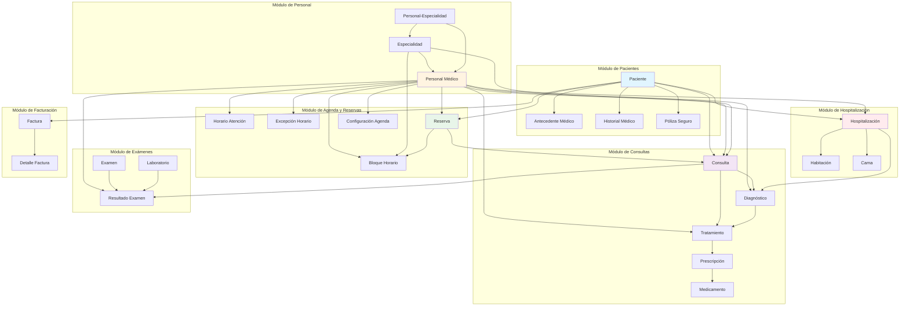

# Modelo Relacional - Sistema de Fichas Médicas de Hospital

Este documento describe el modelo relacional completo para un sistema de gestión de fichas médicas de un hospital.

## 📋 Índice

1. [Descripción General](#descripción-general)
2. [Entidades Principales](#entidades-principales)
3. [Relaciones](#relaciones)
4. [Diagrama de Entidad-Relación](#diagrama-de-entidad-relación)
5. [Estructura de Tablas](#estructura-de-tablas)
6. [Casos de Uso](#casos-de-uso)

## 📖 Descripción General

El modelo relacional está diseñado para gestionar de manera integral todas las operaciones de un hospital, incluyendo:

- Gestión de pacientes y su información personal
- **Agenda médica y sistema de reservas**
- **Horarios de atención de médicos**
- Registro de consultas médicas
- Diagnósticos y tratamientos
- Prescripciones de medicamentos
- Exámenes y resultados de laboratorio
- Hospitalizaciones y gestión de camas
- Historial médico completo
- Facturación y seguros médicos

## 🏗️ Entidades Principales

### 1. **Paciente**
Almacena toda la información personal y médica básica del paciente.

**Campos clave:**
- `documento`: Identificador único (DNI, Pasaporte, etc.)
- `nombre`, `apellido`: Datos personales
- `fecha_nacimiento`: Para calcular edad
- `tipo_sangre`: Información médica importante
- `alergias`: Información crítica para tratamientos
- `contacto_emergencia`: Datos de contacto de emergencia

**Relaciones:**
- Tiene muchas Consultas
- Tiene muchas Reservas
- Tiene muchos Antecedentes Médicos
- Tiene un Historial Médico
- Puede tener Hospitalizaciones
- Puede tener Pólizas de Seguro
- Tiene Facturas

### 2. **Personal Médico**
Información de médicos, enfermeros y otro personal del hospital.

**Campos clave:**
- `numero_matricula`: Identificador profesional único
- `tipo_personal`: Rol (Médico, Enfermero, Técnico, Administrativo)
- `especialidad_id`: Especialidad principal

**Relaciones:**
- Realiza muchas Consultas
- Puede tener múltiples Especialidades (tabla intermedia)
- Tiene Horarios de Atención
- Puede tener Excepciones de Horario
- Tiene Bloques de Horario disponibles
- Tiene Reservas asignadas
- Realiza Diagnósticos
- Prescribe Tratamientos
- Ordena Exámenes

### 3. **Especialidad**
Catálogo de especialidades médicas disponibles.

**Relaciones:**
- Tiene muchos Personal Médico (muchos a muchos)
- Se asocia a Consultas

### 4. **Consulta**
Registro de cada consulta médica realizada.

**Campos clave:**
- `fecha_hora`: Cuándo se realizó/realizará
- `tipo_consulta`: Primera vez, Control, Urgencia, etc.
- `motivo_consulta`: Razón de la visita
- `estado`: Programada, En curso, Completada, etc.

**Relaciones:**
- Pertenece a un Paciente
- Es atendida por un Personal Médico
- Pertenece a una Especialidad
- Puede tener un Diagnóstico
- Puede generar Tratamientos
- Puede tener Resultados de Examen

### 5. **Diagnóstico**
Diagnóstico médico asociado a una consulta.

**Campos clave:**
- `codigo_cie10`: Clasificación internacional de enfermedades
- `nombre`: Nombre del diagnóstico
- `severidad`: Leve, Moderada, Grave, Crítica

**Relaciones:**
- Pertenece a una Consulta
- Realizado por un Personal Médico
- Puede generar Tratamientos
- Puede ser motivo de Hospitalización

### 6. **Tratamiento**
Tratamiento prescrito para un paciente.

**Campos clave:**
- `tipo`: Medicamento, Terapia, Cirugía, etc.
- `fecha_inicio`, `fecha_fin`: Duración del tratamiento
- `estado`: Activo, Completado, Cancelado, Suspendido

**Relaciones:**
- Pertenece a una Consulta
- Puede estar asociado a un Diagnóstico
- Prescrito por un Personal Médico
- Puede tener Prescripciones de Medicamentos

### 7. **Medicamento**
Catálogo de medicamentos disponibles.

**Campos clave:**
- `codigo`: Identificador único
- `principio_activo`: Componente principal
- `requiere_receta`: Si necesita receta médica

**Relaciones:**
- Se prescribe en Prescripciones

### 8. **Prescripción**
Relación entre Tratamiento y Medicamento con detalles de dosificación.

**Campos clave:**
- `dosis`: Cantidad a administrar
- `frecuencia`: Cada cuánto tiempo
- `duracion`: Días de tratamiento

**Relaciones:**
- Pertenece a un Tratamiento
- Prescribe un Medicamento

### 9. **Examen**
Catálogo de exámenes y pruebas médicas disponibles.

**Campos clave:**
- `tipo`: Laboratorio, Imagenología, Funcional, etc.
- `requiere_ayuno`: Si necesita preparación especial

**Relaciones:**
- Se ordena en Resultados de Examen

### 10. **Resultado de Examen**
Resultado de un examen ordenado para un paciente.

**Campos clave:**
- `fecha_orden`, `fecha_realizacion`, `fecha_resultado`: Timeline
- `resultado`: Resultado textual
- `valores`: JSON con valores numéricos
- `estado`: Ordenado, En proceso, Completado, Cancelado

**Relaciones:**
- Pertenece a una Consulta
- Es un Examen específico
- Del Paciente
- Ordenado por un Personal Médico
- Puede ser realizado por un Laboratorio

### 21. **Horario de Atención**
Define los horarios regulares de trabajo de cada médico.

**Campos clave:**
- `dia_semana`: Día de la semana (1=Lunes, 7=Domingo)
- `hora_inicio`, `hora_fin`: Rango horario de atención
- `duracion_cita`: Duración de cada cita en minutos
- `intervalo_entre_citas`: Tiempo entre citas

**Relaciones:**
- Pertenece a un Personal Médico
- Se usa para generar Bloques de Horario

### 22. **Excepción de Horario**
Define días especiales (vacaciones, días libres, horarios especiales).

**Campos clave:**
- `tipo`: Vacaciones, Día libre, Horario especial, etc.
- `fecha_inicio`, `fecha_fin`: Rango de fechas
- `hora_inicio`, `hora_fin`: Horarios especiales (opcional)

**Relaciones:**
- Pertenece a un Personal Médico
- Se usa para excluir bloques de horario

### 23. **Bloque de Horario**
Bloques de tiempo disponibles para reservas, generados automáticamente.

**Campos clave:**
- `fecha`: Fecha del bloque
- `hora_inicio`, `hora_fin`: Rango horario
- `disponible`: Si está disponible para reservar
- `reservado`: Si ya tiene una reserva asignada
- `tipo_bloque`: Regular, Urgencia, Emergencia, Administrativo

**Relaciones:**
- Pertenece a un Personal Médico
- Pertenece a una Especialidad
- Puede tener una Reserva

### 24. **Reserva/Cita**
Reserva de una cita médica.

**Campos clave:**
- `fecha_hora`: Fecha y hora completa de la cita
- `tipo_consulta`: Primera vez, Control, Urgencia, etc.
- `estado`: Reservada, Confirmada, En espera, En atención, Completada, Cancelada, No asistió
- `prioridad`: Normal, Alta, Urgente
- `recordatorio_enviado`: Si se envió recordatorio
- `consulta_id`: Si se convirtió en consulta

**Relaciones:**
- Del Paciente
- Con un Personal Médico
- Con una Especialidad
- Usa un Bloque de Horario
- Puede convertirse en Consulta

### 25. **Configuración de Agenda**
Configuración del sistema de agenda (global o por médico).

**Campos clave:**
- `anticipacion_minima`: Horas mínimas para reservar
- `anticipacion_maxima`: Días máximos para reservar
- `duracion_default`: Duración por defecto en minutos
- `permitir_reservas_online`: Si permite reservas online
- `enviar_recordatorios`: Si envía recordatorios automáticos

**Relaciones:**
- Puede ser global (personal_medico_id = NULL) o específica de un médico

### 11. **Laboratorio**
Información de laboratorios externos o internos.

**Relaciones:**
- Realiza Resultados de Examen

### 12. **Habitación**
Información de las habitaciones del hospital.

**Campos clave:**
- `numero`: Identificador único
- `tipo`: Individual, Doble, UCI, etc.
- `capacidad`: Número de camas

**Relaciones:**
- Tiene muchas Camas
- Aloja Hospitalizaciones

### 13. **Cama**
Camas disponibles en las habitaciones.

**Campos clave:**
- `numero`: Identificador dentro de la habitación
- `tipo`: Normal, UCI, UCC, Aislamiento
- `disponible`: Estado de disponibilidad

**Relaciones:**
- Pertenece a una Habitación
- Se usa en Hospitalizaciones

### 14. **Hospitalización**
Registro de internación de un paciente.

**Campos clave:**
- `fecha_ingreso`, `fecha_alta`: Período de internación
- `motivo_ingreso`: Razón de la hospitalización
- `estado`: Activa, Alta médica, Alta voluntaria, Fallecimiento

**Relaciones:**
- Del Paciente
- En una Habitación específica
- En una Cama específica
- Con un Personal Médico responsable
- Puede tener Diagnóstico de ingreso y alta

### 15. **Antecedente Médico**
Historial de condiciones médicas previas del paciente.

**Campos clave:**
- `tipo`: Enfermedad crónica, Cirugía previa, Alergia, etc.
- `activo`: Si la condición sigue activa

**Relaciones:**
- Pertenece a un Paciente

### 16. **Historial Médico**
Registro cronológico de todos los eventos médicos del paciente.

**Campos clave:**
- `tipo_registro`: Consulta, Hospitalización, Examen, etc.
- `referencia_id`: ID del registro original
- `archivos_adjuntos`: JSON con archivos relacionados

**Relaciones:**
- Pertenece a un Paciente
- Puede tener un Personal Médico asociado

### 17. **Seguro Médico**
Catálogo de seguros médicos.

**Relaciones:**
- Tiene Pólizas de Seguro

### 18. **Póliza de Seguro**
Seguro médico del paciente.

**Campos clave:**
- `numero_poliza`: Identificador de la póliza
- `fecha_inicio`, `fecha_fin`: Vigencia
- `cobertura`: JSON con detalles de cobertura

**Relaciones:**
- Pertenece a un Paciente
- Es de un Seguro Médico específico

### 19. **Factura**
Facturación de servicios médicos.

**Campos clave:**
- `numero_factura`: Identificador único
- `subtotal`, `descuento`, `impuesto`, `total`: Cálculos financieros
- `estado`: Pendiente, Pagada, Vencida, Cancelada
- `metodo_pago`: Efectivo, Tarjeta, Transferencia, Seguro

**Relaciones:**
- Del Paciente
- Tiene muchos Detalles de Factura

### 20. **Detalle de Factura**
Líneas de detalle de una factura.

**Campos clave:**
- `concepto`: Descripción del servicio
- `tipo_concepto`: Consulta, Examen, Medicamento, etc.
- `referencia_id`: ID del servicio facturado

**Relaciones:**
- Pertenece a una Factura

## 🔗 Relaciones

### Relaciones Uno a Muchos (1:N)

1. **Paciente → Consulta**: Un paciente tiene muchas consultas
2. **Paciente → Reserva**: Un paciente tiene muchas reservas
3. **Paciente → Hospitalización**: Un paciente puede tener múltiples hospitalizaciones
4. **Paciente → Antecedente Médico**: Un paciente tiene muchos antecedentes
5. **Paciente → Historial Médico**: Un paciente tiene un historial completo
6. **Paciente → Factura**: Un paciente tiene muchas facturas
7. **Personal Médico → Consulta**: Un médico atiende muchas consultas
8. **Personal Médico → Horario Atención**: Un médico tiene varios horarios
9. **Personal Médico → Excepción Horario**: Un médico puede tener varias excepciones
10. **Personal Médico → Bloque Horario**: Un médico tiene muchos bloques
11. **Personal Médico → Reserva**: Un médico tiene muchas reservas
12. **Especialidad → Consulta**: Una especialidad tiene muchas consultas
13. **Especialidad → Bloque Horario**: Una especialidad tiene muchos bloques
14. **Consulta → Diagnóstico**: Una consulta puede tener un diagnóstico
15. **Consulta → Tratamiento**: Una consulta puede generar varios tratamientos
16. **Consulta → Resultado Examen**: Una consulta puede ordenar varios exámenes
17. **Tratamiento → Prescripción**: Un tratamiento puede tener varias prescripciones
18. **Habitación → Cama**: Una habitación tiene varias camas
19. **Factura → Detalle Factura**: Una factura tiene varios detalles
20. **Bloque Horario → Reserva**: Un bloque puede tener una reserva (1:1 en práctica)

### Relaciones Muchos a Muchos (N:M)

1. **Personal Médico ↔ Especialidad**: Un médico puede tener múltiples especialidades y una especialidad puede tener muchos médicos (tabla intermedia: `personal_especialidad`)

### Relaciones con Referencias Opcionales

- **Consulta → Diagnóstico**: Una consulta puede no tener diagnóstico aún
- **Tratamiento → Diagnóstico**: Un tratamiento puede no estar asociado a un diagnóstico específico
- **Resultado Examen → Laboratorio**: Puede ser realizado internamente

## 📊 Diagrama de Entidad-Relación

### Diagrama Visual Completo (Mermaid)

```mermaid
erDiagram
    %% Entidades Principales
    PACIENTE ||--o{ CONSULTA : "tiene"
    PACIENTE ||--o{ RESERVA : "tiene"
    PACIENTE ||--o{ HOSPITALIZACION : "tiene"
    PACIENTE ||--o{ ANTECEDENTE_MEDICO : "tiene"
    PACIENTE ||--o{ HISTORIAL_MEDICO : "tiene"
    PACIENTE ||--o{ POLIZA_SEGURO : "tiene"
    PACIENTE ||--o{ FACTURA : "tiene"
    
    PERSONAL_MEDICO ||--o{ CONSULTA : "atiende"
    PERSONAL_MEDICO ||--o{ RESERVA : "tiene"
    PERSONAL_MEDICO ||--o{ HORARIO_ATENCION : "tiene"
    PERSONAL_MEDICO ||--o{ EXCEPCION_HORARIO : "tiene"
    PERSONAL_MEDICO ||--o{ BLOQUE_HORARIO : "tiene"
    PERSONAL_MEDICO ||--o{ DIAGNOSTICO : "realiza"
    PERSONAL_MEDICO ||--o{ TRATAMIENTO : "prescribe"
    PERSONAL_MEDICO ||--o{ RESULTADO_EXAMEN : "ordena"
    PERSONAL_MEDICO ||--o{ HOSPITALIZACION : "responsable"
    PERSONAL_MEDICO }o--|| ESPECIALIDAD : "pertenece"
    PERSONAL_MEDICO ||--o| CONFIGURACION_AGENDA : "configura"
    
    ESPECIALIDAD ||--o{ CONSULTA : "se_asocia"
    ESPECIALIDAD ||--o{ BLOQUE_HORARIO : "tiene"
    ESPECIALIDAD }o--o{ PERSONAL_MEDICO : "tiene_muchos"
    
    CONSULTA ||--o| DIAGNOSTICO : "tiene"
    CONSULTA ||--o{ TRATAMIENTO : "genera"
    CONSULTA ||--o{ RESULTADO_EXAMEN : "ordena"
    CONSULTA ||--o| RESERVA : "proviene_de"
    
    DIAGNOSTICO ||--o{ TRATAMIENTO : "genera"
    DIAGNOSTICO ||--o| HOSPITALIZACION : "motivo_ingreso"
    DIAGNOSTICO ||--o| HOSPITALIZACION : "motivo_alta"
    
    TRATAMIENTO ||--o{ PRESCRIPCION : "tiene"
    
    MEDICAMENTO ||--o{ PRESCRIPCION : "se_prescribe"
    
    EXAMEN ||--o{ RESULTADO_EXAMEN : "tiene"
    
    LABORATORIO ||--o{ RESULTADO_EXAMEN : "realiza"
    
    HABITACION ||--o{ CAMA : "tiene"
    HABITACION ||--o{ HOSPITALIZACION : "alberga"
    
    CAMA ||--o{ HOSPITALIZACION : "usa"
    
    BLOQUE_HORARIO ||--o| RESERVA : "tiene"
    BLOQUE_HORARIO }o--|| ESPECIALIDAD : "pertenece"
    
    SEGURO_MEDICO ||--o{ POLIZA_SEGURO : "tiene"
    
    FACTURA ||--o{ DETALLE_FACTURA : "tiene"
    
    %% Definiciones de Entidades
    PACIENTE {
        int id PK
        string documento UK
        string tipo_documento
        string nombre
        string apellido
        date fecha_nacimiento
        string genero
        string telefono
        string email
        string direccion
        string tipo_sangre
        text alergias
        boolean activo
    }
    
    PERSONAL_MEDICO {
        int id PK
        string documento UK
        string numero_matricula UK
        string nombre
        string apellido
        string tipo_personal
        int especialidad_id FK
        boolean activo
    }
    
    ESPECIALIDAD {
        int id PK
        string codigo UK
        string nombre
        boolean activa
    }
    
    CONSULTA {
        int id PK
        int paciente_id FK
        int personal_medico_id FK
        int especialidad_id FK
        timestamp fecha_hora
        string tipo_consulta
        text motivo_consulta
        string estado
    }
    
    RESERVA {
        int id PK
        int paciente_id FK
        int personal_medico_id FK
        int especialidad_id FK
        int bloque_horario_id FK
        timestamp fecha_hora
        string tipo_consulta
        string estado
        string prioridad
        int consulta_id FK
    }
    
    HORARIO_ATENCION {
        int id PK
        int personal_medico_id FK
        int dia_semana
        time hora_inicio
        time hora_fin
        int duracion_cita
        boolean activo
    }
    
    EXCEPCION_HORARIO {
        int id PK
        int personal_medico_id FK
        string tipo
        date fecha_inicio
        date fecha_fin
        time hora_inicio
        time hora_fin
        boolean activa
    }
    
    BLOQUE_HORARIO {
        int id PK
        int personal_medico_id FK
        int especialidad_id FK
        date fecha
        time hora_inicio
        time hora_fin
        boolean disponible
        boolean reservado
    }
    
    DIAGNOSTICO {
        int id PK
        string codigo_cie10
        string nombre
        string tipo
        int consulta_id FK
        int personal_medico_id FK
        boolean activo
    }
    
    TRATAMIENTO {
        int id PK
        int consulta_id FK
        int diagnostico_id FK
        string nombre
        string tipo
        date fecha_inicio
        string estado
        int personal_medico_id FK
    }
    
    MEDICAMENTO {
        int id PK
        string codigo UK
        string nombre
        string principio_activo
        boolean requiere_receta
        boolean activo
    }
    
    PRESCRIPCION {
        int id PK
        int tratamiento_id FK
        int medicamento_id FK
        string dosis
        string frecuencia
        int duracion
        string estado
    }
    
    EXAMEN {
        int id PK
        string codigo UK
        string nombre
        string tipo
        boolean requiere_ayuno
        boolean activo
    }
    
    RESULTADO_EXAMEN {
        int id PK
        int consulta_id FK
        int examen_id FK
        int paciente_id FK
        int personal_medico_id FK
        int laboratorio_id FK
        timestamp fecha_orden
        text resultado
        string estado
    }
    
    LABORATORIO {
        int id PK
        string nombre
        string direccion
        string telefono
        boolean activo
    }
    
    HOSPITALIZACION {
        int id PK
        int paciente_id FK
        int habitacion_id FK
        int cama_id FK
        int personal_medico_id FK
        timestamp fecha_ingreso
        timestamp fecha_alta
        string estado
    }
    
    HABITACION {
        int id PK
        string numero UK
        string tipo
        int piso
        int capacidad
        boolean activa
    }
    
    CAMA {
        int id PK
        int habitacion_id FK
        string numero
        string tipo
        boolean disponible
        boolean activa
    }
    
    ANTECEDENTE_MEDICO {
        int id PK
        int paciente_id FK
        string tipo
        text descripcion
        boolean activo
    }
    
    HISTORIAL_MEDICO {
        int id PK
        int paciente_id FK
        string tipo_registro
        int referencia_id
        timestamp fecha
        text descripcion
    }
    
    SEGURO_MEDICO {
        int id PK
        string codigo UK
        string nombre
        string tipo
        boolean activo
    }
    
    POLIZA_SEGURO {
        int id PK
        int paciente_id FK
        int seguro_medico_id FK
        string numero_poliza
        date fecha_inicio
        boolean activa
    }
    
    FACTURA {
        int id PK
        string numero_factura UK
        int paciente_id FK
        timestamp fecha_emision
        decimal total
        string estado
    }
    
    DETALLE_FACTURA {
        int id PK
        int factura_id FK
        string concepto
        int cantidad
        decimal precio_unitario
        decimal subtotal
    }
    
    CONFIGURACION_AGENDA {
        int id PK
        int personal_medico_id FK
        int anticipacion_minima
        int anticipacion_maxima
        int duracion_default
        boolean permitir_reservas_online
        boolean enviar_recordatorios
    }
    
    PERSONAL_ESPECIALIDAD {
        int id PK
        int personal_medico_id FK
        int especialidad_id FK
        boolean activa
    }
```



### Diagrama Simplificado por Módulos



## 📁 Estructura de Tablas

### Tablas Principales (26 tablas)

1. `paciente`
2. `personal_medico`
3. `especialidad`
4. `personal_especialidad` (tabla intermedia)
5. `consulta`
6. `diagnostico`
7. `tratamiento`
8. `medicamento`
9. `prescripcion`
10. `examen`
11. `laboratorio`
12. `resultado_examen`
13. `habitacion`
14. `cama`
15. `hospitalizacion`
16. `antecedente_medico`
17. `historial_medico`
18. `seguro_medico`
19. `poliza_seguro`
20. `factura`
21. `detalle_factura`
22. `horario_atencion` ⭐ **NUEVO**
23. `excepcion_horario` ⭐ **NUEVO**
24. `bloque_horario` ⭐ **NUEVO**
25. `reserva` ⭐ **NUEVO**
26. `configuracion_agenda` ⭐ **NUEVO**

### Índices Creados

- Índices en campos de búsqueda frecuente (documento, nombre, apellido)
- Índices en foreign keys para optimizar joins
- Índices en campos de filtrado (estado, fecha, activo)

### Triggers Implementados

1. **Actualización automática de timestamps**: Actualiza `fecha_actualizacion` en Paciente, Consulta, Horario Atención y Reserva
2. **Gestión de disponibilidad de camas**: Actualiza automáticamente la disponibilidad de camas cuando cambia el estado de una hospitalización
3. **Gestión de bloques de horario**: Actualiza automáticamente la disponibilidad de bloques cuando se crea o cancela una reserva ⭐ **NUEVO**

### Vistas Útiles

1. **vista_paciente_ultima_consulta**: Muestra pacientes con su última consulta y total de consultas
2. **vista_consultas_hoy**: Lista todas las consultas programadas para el día actual
3. **vista_hospitalizaciones_activas**: Muestra todas las hospitalizaciones en curso
4. **vista_reservas_hoy** ⭐ **NUEVO**: Lista todas las reservas del día actual con información del paciente y médico
5. **vista_disponibilidad_medicos** ⭐ **NUEVO**: Muestra horarios de atención y disponibilidad de cada médico
6. **vista_proximas_reservas_paciente** ⭐ **NUEVO**: Muestra las próximas reservas de un paciente con información de proximidad

## 💡 Casos de Uso

### 1. Registrar una Nueva Consulta
```
1. Buscar o crear Paciente
2. Seleccionar Personal Médico y Especialidad
3. Crear registro en tabla Consulta
4. Si hay diagnóstico, crear registro en Diagnóstico
5. Si hay tratamientos, crear registros en Tratamiento
6. Si se prescriben medicamentos, crear Prescripciones
7. Actualizar Historial Médico
```

### 2. Ordenar un Examen
```
1. Desde una Consulta, crear registro en Resultado Examen
2. Asignar Laboratorio (opcional)
3. Actualizar estado conforme avanza el proceso
4. Registrar resultado cuando esté disponible
5. Actualizar Historial Médico
```

### 3. Hospitalizar un Paciente
```
1. Verificar disponibilidad de Cama
2. Crear registro en Hospitalización
3. Actualizar disponibilidad de Cama (automático por trigger)
4. Registrar Diagnóstico de ingreso
5. Actualizar Historial Médico
```

### 4. Generar Factura
```
1. Crear registro en Factura
2. Agregar Detalles de Factura por cada servicio
3. Calcular totales
4. Si aplica, asociar con Seguro Médico del paciente
```

### 5. Consultar Historial Completo
```
1. Buscar Paciente
2. Consultar Historial Médico ordenado por fecha
3. Para cada registro, obtener detalles según tipo_registro
```

### 6. Configurar Horarios de Atención de un Médico ⭐ **NUEVO**
```
1. Seleccionar Personal Médico
2. Para cada día de la semana, crear registros en Horario Atención
3. Definir hora_inicio, hora_fin, duracion_cita, intervalo_entre_citas
4. Activar los horarios
5. El sistema generará automáticamente Bloques de Horario
```

### 7. Crear una Reserva/Cita ⭐ **NUEVO**
```
1. Buscar o crear Paciente
2. Seleccionar Personal Médico y Especialidad
3. Consultar Bloques de Horario disponibles
4. Filtrar por fecha y hora deseada
5. Verificar que no haya excepciones de horario
6. Crear registro en Reserva
7. El sistema actualizará automáticamente el Bloque de Horario (trigger)
8. Enviar confirmación al paciente (opcional)
```

### 8. Gestionar Excepciones de Horario ⭐ **NUEVO**
```
1. Seleccionar Personal Médico
2. Crear registro en Excepción Horario
3. Definir tipo (Vacaciones, Día libre, etc.)
4. Establecer fecha_inicio y fecha_fin
5. Si es horario especial, definir hora_inicio y hora_fin
6. El sistema excluirá automáticamente los bloques afectados
```

### 9. Convertir Reserva en Consulta ⭐ **NUEVO**
```
1. Cuando el paciente llega, actualizar estado de Reserva a "En atención"
2. Crear registro en Consulta vinculado a la Reserva
3. Actualizar consulta_id en Reserva
4. Continuar con el flujo normal de consulta
5. Al finalizar, actualizar estado de Reserva a "Completada"
```

### 10. Cancelar una Reserva ⭐ **NUEVO**
```
1. Buscar Reserva
2. Verificar políticas de cancelación (horas permitidas)
3. Actualizar estado a "Cancelada"
4. Registrar cancelado_por y motivo_cancelacion
5. El sistema liberará automáticamente el Bloque de Horario (trigger)
6. Notificar al paciente (opcional)
```

## 🔒 Consideraciones de Seguridad

- Todos los campos sensibles deben estar encriptados (ej: datos personales)
- Implementar auditoría de cambios en tablas críticas
- Control de acceso basado en roles (médico, enfermero, administrativo)
- Cumplimiento con normativas de protección de datos (HIPAA, GDPR, etc.)

## 📈 Mejoras Futuras

- Tabla de auditoría para rastrear todos los cambios
- Tabla de usuarios y autenticación
- Tabla de permisos y roles
- Tabla de notificaciones y recordatorios
- Sistema de generación automática de bloques de horario
- Integración con sistemas externos (laboratorios, farmacias)
- Sistema de espera (lista de espera para citas canceladas)
- Integración con calendarios externos (Google Calendar, Outlook)

## 📝 Notas de Implementación

- El esquema SQL está optimizado para PostgreSQL
- Las interfaces TypeScript están en `medical-record.model.ts`
- El esquema SQL está en `medical-record.schema.sql`
- Se recomienda usar un ORM (TypeORM, Prisma, Sequelize) para la implementación

