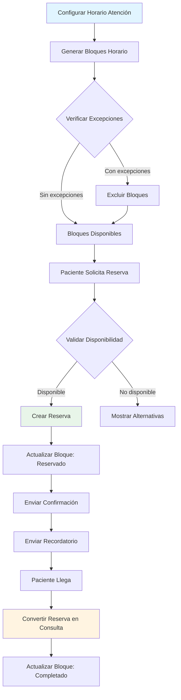
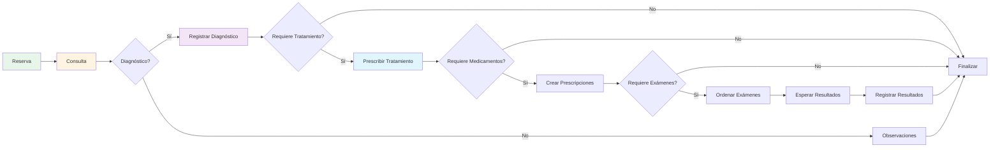
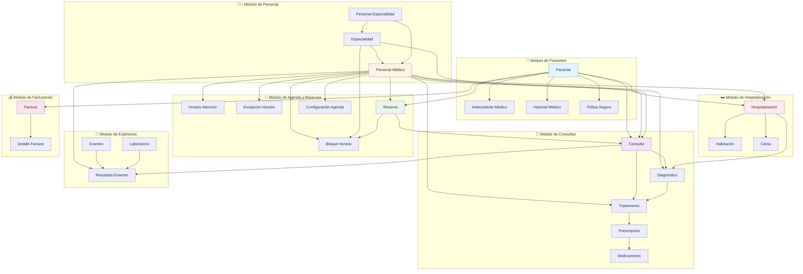

# Diagrama Relacional - Sistema de Fichas Médicas

Este archivo contiene diagramas visuales del modelo relacional usando Mermaid.

## 📊 Diagrama Completo de Entidad-Relación

```mermaid
erDiagram
    %% Entidades Principales
    PACIENTE ||--o{ CONSULTA : "tiene"
    PACIENTE ||--o{ RESERVA : "tiene"
    PACIENTE ||--o{ HOSPITALIZACION : "tiene"
    PACIENTE ||--o{ ANTECEDENTE_MEDICO : "tiene"
    PACIENTE ||--o{ HISTORIAL_MEDICO : "tiene"
    PACIENTE ||--o{ POLIZA_SEGURO : "tiene"
    PACIENTE ||--o{ FACTURA : "tiene"
    
    PERSONAL_MEDICO ||--o{ CONSULTA : "atiende"
    PERSONAL_MEDICO ||--o{ RESERVA : "tiene"
    PERSONAL_MEDICO ||--o{ HORARIO_ATENCION : "tiene"
    PERSONAL_MEDICO ||--o{ EXCEPCION_HORARIO : "tiene"
    PERSONAL_MEDICO ||--o{ BLOQUE_HORARIO : "tiene"
    PERSONAL_MEDICO ||--o{ DIAGNOSTICO : "realiza"
    PERSONAL_MEDICO ||--o{ TRATAMIENTO : "prescribe"
    PERSONAL_MEDICO ||--o{ RESULTADO_EXAMEN : "ordena"
    PERSONAL_MEDICO ||--o{ HOSPITALIZACION : "responsable"
    PERSONAL_MEDICO }o--|| ESPECIALIDAD : "pertenece"
    PERSONAL_MEDICO ||--o| CONFIGURACION_AGENDA : "configura"
    
    ESPECIALIDAD ||--o{ CONSULTA : "se_asocia"
    ESPECIALIDAD ||--o{ BLOQUE_HORARIO : "tiene"
    ESPECIALIDAD }o--o{ PERSONAL_MEDICO : "tiene_muchos"
    
    CONSULTA ||--o| DIAGNOSTICO : "tiene"
    CONSULTA ||--o{ TRATAMIENTO : "genera"
    CONSULTA ||--o{ RESULTADO_EXAMEN : "ordena"
    CONSULTA ||--o| RESERVA : "proviene_de"
    
    DIAGNOSTICO ||--o{ TRATAMIENTO : "genera"
    DIAGNOSTICO ||--o| HOSPITALIZACION : "motivo_ingreso"
    DIAGNOSTICO ||--o| HOSPITALIZACION : "motivo_alta"
    
    TRATAMIENTO ||--o{ PRESCRIPCION : "tiene"
    
    MEDICAMENTO ||--o{ PRESCRIPCION : "se_prescribe"
    
    EXAMEN ||--o{ RESULTADO_EXAMEN : "tiene"
    
    LABORATORIO ||--o{ RESULTADO_EXAMEN : "realiza"
    
    HABITACION ||--o{ CAMA : "tiene"
    HABITACION ||--o{ HOSPITALIZACION : "alberga"
    
    CAMA ||--o{ HOSPITALIZACION : "usa"
    
    BLOQUE_HORARIO ||--o| RESERVA : "tiene"
    BLOQUE_HORARIO }o--|| ESPECIALIDAD : "pertenece"
    
    SEGURO_MEDICO ||--o{ POLIZA_SEGURO : "tiene"
    
    FACTURA ||--o{ DETALLE_FACTURA : "tiene"
    
    %% Definiciones de Entidades
    PACIENTE {
        int id PK
        string documento UK
        string nombre
        string apellido
        date fecha_nacimiento
        string telefono
        string email
        boolean activo
    }
    
    PERSONAL_MEDICO {
        int id PK
        string documento UK
        string numero_matricula UK
        string nombre
        string apellido
        string tipo_personal
        int especialidad_id FK
        boolean activo
    }
    
    ESPECIALIDAD {
        int id PK
        string codigo UK
        string nombre
        boolean activa
    }
    
    CONSULTA {
        int id PK
        int paciente_id FK
        int personal_medico_id FK
        int especialidad_id FK
        timestamp fecha_hora
        string tipo_consulta
        string estado
    }
    
    RESERVA {
        int id PK
        int paciente_id FK
        int personal_medico_id FK
        int especialidad_id FK
        int bloque_horario_id FK
        timestamp fecha_hora
        string estado
        int consulta_id FK
    }
    
    HORARIO_ATENCION {
        int id PK
        int personal_medico_id FK
        int dia_semana
        time hora_inicio
        time hora_fin
        int duracion_cita
        boolean activo
    }
    
    EXCEPCION_HORARIO {
        int id PK
        int personal_medico_id FK
        string tipo
        date fecha_inicio
        date fecha_fin
        boolean activa
    }
    
    BLOQUE_HORARIO {
        int id PK
        int personal_medico_id FK
        int especialidad_id FK
        date fecha
        time hora_inicio
        time hora_fin
        boolean disponible
        boolean reservado
    }
    
    DIAGNOSTICO {
        int id PK
        string codigo_cie10
        string nombre
        int consulta_id FK
        int personal_medico_id FK
        boolean activo
    }
    
    TRATAMIENTO {
        int id PK
        int consulta_id FK
        int diagnostico_id FK
        string nombre
        string tipo
        string estado
        int personal_medico_id FK
    }
    
    MEDICAMENTO {
        int id PK
        string codigo UK
        string nombre
        string principio_activo
        boolean requiere_receta
    }
    
    PRESCRIPCION {
        int id PK
        int tratamiento_id FK
        int medicamento_id FK
        string dosis
        string frecuencia
        int duracion
    }
    
    EXAMEN {
        int id PK
        string codigo UK
        string nombre
        string tipo
        boolean requiere_ayuno
    }
    
    RESULTADO_EXAMEN {
        int id PK
        int consulta_id FK
        int examen_id FK
        int paciente_id FK
        int personal_medico_id FK
        int laboratorio_id FK
        timestamp fecha_orden
        text resultado
        string estado
    }
    
    LABORATORIO {
        int id PK
        string nombre
        string direccion
        string telefono
        boolean activo
    }
    
    HOSPITALIZACION {
        int id PK
        int paciente_id FK
        int habitacion_id FK
        int cama_id FK
        int personal_medico_id FK
        timestamp fecha_ingreso
        timestamp fecha_alta
        string estado
    }
    
    HABITACION {
        int id PK
        string numero UK
        string tipo
        int piso
        int capacidad
        boolean activa
    }
    
    CAMA {
        int id PK
        int habitacion_id FK
        string numero
        string tipo
        boolean disponible
        boolean activa
    }
    
    ANTECEDENTE_MEDICO {
        int id PK
        int paciente_id FK
        string tipo
        text descripcion
        boolean activo
    }
    
    HISTORIAL_MEDICO {
        int id PK
        int paciente_id FK
        string tipo_registro
        int referencia_id
        timestamp fecha
        text descripcion
    }
    
    SEGURO_MEDICO {
        int id PK
        string codigo UK
        string nombre
        string tipo
        boolean activo
    }
    
    POLIZA_SEGURO {
        int id PK
        int paciente_id FK
        int seguro_medico_id FK
        string numero_poliza
        date fecha_inicio
        boolean activa
    }
    
    FACTURA {
        int id PK
        string numero_factura UK
        int paciente_id FK
        timestamp fecha_emision
        decimal total
        string estado
    }
    
    DETALLE_FACTURA {
        int id PK
        int factura_id FK
        string concepto
        int cantidad
        decimal precio_unitario
        decimal subtotal
    }
    
    CONFIGURACION_AGENDA {
        int id PK
        int personal_medico_id FK
        int anticipacion_minima
        int anticipacion_maxima
        int duracion_default
        boolean permitir_reservas_online
    }
```

## 🔄 Flujo de Agenda y Reservas

## 🏥 Flujo de Consulta Médica

## 📅 Vista de Módulos del Sistema

## 🔑 Leyenda de Relaciones

- `||--o{` : Uno a Muchos (1:N)
- `}o--o{` : Muchos a Muchos (N:M)
- `||--o|` : Uno a Uno (1:1)
- `}o--||` : Muchos a Uno (N:1)

## 📝 Notas

- **PK**: Primary Key (Clave Primaria)
- **FK**: Foreign Key (Clave Foránea)
- **UK**: Unique Key (Clave Única)

Los diagramas se pueden visualizar en:
- GitHub (renderizado automático)
- VS Code (con extensión Mermaid)
- Editores online como mermaid.live
- Documentación Markdown compatible

